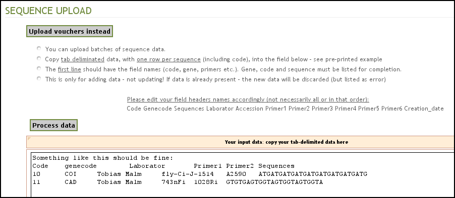
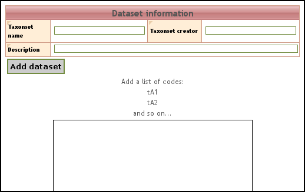

.. VoSeq documentation master file, created by
   sphinx-quickstart on Mon Apr  1 22:15:34 2013.
   You can adapt this file completely to your liking, but it should at least
   contain the root `toctree` directive.

Welcome to VoSeq's documentation!
=================================

Contents:

.. toctree::
   :maxdepth: 2

..
	>>>>>>>>>>>>>>>>>>>>>>>>>>>>>>>><
	Page 1.

-----------
Hello there
-----------

Welcome to **VoSeq**, a database to store voucher and DNA sequence data for
phylogenetic analysis. It's a unique database that enables to digitize
biological data of museum specimens and molecular data such as DNA sequences,
primers and genes.

VoSeq has tools that facilitate the batch upload of lots of voucher data and
DNA sequences with a few clicks. It also has 
`BLAST <http://en.wikipedia.org/wiki/BLAST/>`_ capabilities, meaning that you
can find out whether one particular
DNA sequence is most similar to other sequence in `NCBI GenBank 
<http://www.ncbi.nlm.nih.gov/genbank/>`_. You can also BLAST your sequence
against all others in your VoSeq database (see :ref:`blast-plugin` section for
details).

VoSeq is written mainly in `PHP <http://www.php.net/>`_. It uses 
`MySQL`_ as back-end and it is designed to run in a
local server (for example by installing `Apache <http://httpd.apache.org/>`_
on your computer) or to run on any commercial server service.

.. image:: images/intro1.png
   :align: center
   :width: 240px

.. image:: images/create_taxonset2_small.png
   :align: center
   :width: 357px

.. image:: images/create_dataset_small.png
   :align: center
   :width: 329px

.. _MySQL: http://www.mysql.com

^^^^^^^^^^^^^^^^^
How to cite VoSeq
^^^^^^^^^^^^^^^^^
If you think VoSeq is useful and you happen to use it during your work, it
would be great if you cite us as a source:

* Peña, C. & Malm, T. **2012**. VoSeq: a Voucher and DNA Sequence Web Application. *PLOS ONE*, 7(6): e39071.  `doi <http://dx.doi.org/10.1371/journal.pone.0039071>`_

^^^^^^^^^^^^^^^^^^^^^^^^^^^^
Help and contact information
^^^^^^^^^^^^^^^^^^^^^^^^^^^^

If you need help regarding installation or usage of th application, please
contact `Carlos Peña <mycalesis@gmail.com>`_ or `Tobias Malm <tobemalm@gmail.com>`_.

You can also subscribe to VoSeq's discussion list on `Google Groups <https://groups.google.com/d/forum/voseq-discussion-list>`_.

..
	>>>>>>>>>>>>>>>>>>>>>>>>>>>>>>>><
	Page 2.

---------------
Getting Started
---------------
Once you have successfully downloaded VoSeq, you can find out how to:

* :ref:`install_in_linux`
* :ref:`install_in_mac`
* :ref:`install_in_windows`
* :ref:`quick_guide` to get started with VoSeq.

.. _install_in_linux:

^^^^^^^^^^^^^^^^
Install in Linux
^^^^^^^^^^^^^^^^
Before installing VoSeq, you need to install in your computer a web server 
(such as `Apache <http://httpd.apache.org/>`_) and the relational database
`MySQL`_.

"""""""""""""""""
Required software
"""""""""""""""""

* Web server with PHP 5.0 or higher (http://www.php.net/manual/install.unix.php). **Compile it with the library CURL**, which is needed to do BLASTs against GenBank.

	* Apache HTTP Server
	* PHP
* A MySQL server 5.0 or higher (see http://www.mysql.com)
* GD library

.. note:: These instructions assume that your are using Linux and Apache, and have installed `LAMP <http://en.wikipedia.org/wiki/LAMP>`_ (Linux, Apache, MySQL and PHP on your computer).

#. Compile PHP with support for the graphics library GD. More info `here <http://www.php.net/manual/en/image.installation.php>`_.
#. Download VoSeq: `Download from github <https://github.com/carlosp420/VoSeq/tags>`_.
#. Unzip the source files in some directory: ``unzip VoSeq_X.Y.Z.zip``
#. If you are not a Linux Guru and you have `WinRAR <http://www.rarlab.com/>`_ (like WinZip but works with gzipped files) on your Windows system you can cheat a little bit here. You can download the file to your Windows machine, use WinRAR to unzip the gzipped file into a directory in Windows and then use an FTP program like `WinSCP <http://winscp.net/eng/index.php>`_ to transfer the entire VoSeq directory for you to a commercial server for example.
#. Move the directory into your web directory: e.g. ``mv VoSeq /usr/local/apache2/htdocs/myVoSeq`` or ``mv VoSeq public_html/myVoSeq`` or use your FTP software to do this for you.
#. To run the installation script, you'll need to temporarily make your myVoSeq directory writable by the web server. The simplest way to do this on a Unix/Linux system is to make it world-writable by typing: ``chmod -R 777 myVoSeq``. To do this into a commercial server you will need a telnet client like `PuTTY <http://www.chiark.greenend.org.uk/~sgtatham/putty/>`_ on your system.
#. At this point you should have Apache and MySQL running (this varies between distributions and setups, see their documentations for details).
#. Go to your web browser and surf into the VoSeq installation directory (under ``htdocs`` or ``public_html`` folders of Apache). It will direct you to the config script (if it doesn't, just load up the ``http://localhost/myVoSeq/index.php`` file. Fill out the forms.
#. If all goes well, the installer will create a configuration file named ``conf.php`` in your myVoSeq installation directory. This file will contain all the important variables and information needed to run VoSeq in your system. 

.. _install_in_mac:

^^^^^^^^^^^^^^^^^^^
Install in Mac OS X
^^^^^^^^^^^^^^^^^^^
We have successfully installed VoSeq in a MacBook OS X Lion. It appears that the Mac
operative systems **come already with Apache and PHP installed**. However you will
need to enable Apache to read and run PHP files. 

"""""""""""""""""""""""""""""""""""""""""""""""""""""
To connect Apache and PHP so that they work together:
"""""""""""""""""""""""""""""""""""""""""""""""""""""

#. Edit Apache's configuration text file:

    * ``sudo nano /etc/apache2/httpd.conf``
#. Make sure that the line: ``LoadModule php5_module     libexec/apache2/libphp5.so``  is in the file and it is not commented (there is no # symbol at the beginning of the line).
#. Find the section ``<IfModule mime_module>`` and write the following line ``AddType application/x-httpd-php .php`` so that Apache will run any file with the extension .php as a script and will not show it as plain text.

"""""""""""""
Install MySQL
"""""""""""""
Unfortunately Mac OS X systems don't come with MySQL installed. You can download it from here: 

#. Download MySQL from here: http://dev.mysql.com/downloads/mysql/5.1.html 

    * Download the ``.dmg`` package according to your systems specifications (32 bits or 64 bits).
#. You might also want to install MySQL GUI Tools http://dev.mysql.com/downloads/gui-tools/5.0.html
#. The following is a quick guide to installling MySQL on your computer. **It is not comprehensive and you will find much more info in the documentation for installing MySQL here**: http://dev.mysql.com/doc/mysql-macosx-excerpt/5.5/en/index.html
#. Unpack and install both pieces of software. Make sure you install the package, in my case, ``mysql-5.1.60-osx10.6-x86_64.pkg`` and ``MySQLStartupitem.pkg``
#. Start the MySQL server by typing in the terminal: ``sudo /Library/StartupItems/MySQLCOM/MySQLCOM start``
#. Create a password for the user **root** by typing: ``/usr/local/mysql/bin/mysqladmin -uroot password 'myownpassword'``

"""""""""""""
Install VoSeq
"""""""""""""
#. To start Apache, go to System Preferences>Sharing> and tick Web Sharing to start your web server. Your assigned folder to host your webpages and VoSeq installation is the folder Sites in your Home directory: ``/Users/YourName/Sites``. You will need to place there the source files of ``VoSeq_X.Y.Z.zip``
#. You need to click the button "create personal share folder" to create the folder "Sites".
#. Open a Terminal: go to Applications>Utilities>Terminal. In the Terminal window, type ``cd ~/Sites`` to go to the folder where the file ``Voseq_X.Y.Z.zip`` should be.
#. Unpack the contents by typing ``unzip VoSeq_X.Y.Z.zip``  
#. Start the MySQL server: ``sudo /Library/StartupItems/MySQLCOM/MySQLCOM start``
#. Go to your web browser and point it to the VoSeq installation directory: ``http://localhost/~YourName/VoSeq``. It will direct you to the config script. Fill out the forms.
#. If all goes well, the installer will create a configuration file named ``conf.php`` in your VoSeq installation directory. This file will contain all the important variables and information needed to run VoSeq in your system.  
#. If during installation, VoSeq cannot connect to MySQL server, you might need to modify your ``/usr/local/mysql/support-files/my-large.cnf`` file parameters:

    * Modify the lines ``/var/mysqld/mysqld.sock`` to  this ``/tmp/mysql.sock`` 
    * Save the file as ``/etc/my.cnf``

.. _install_in_windows:

^^^^^^^^^^^^^^^^^^^^^^^^^^^^^^^^^
Install in Windows 7 / Vista / XP
^^^^^^^^^^^^^^^^^^^^^^^^^^^^^^^^^

Follow these instructions to install Apache, PHP and MySQL and lastly VoSeq on Windows 7 / Vista / XP systems - its not as hard as it looks!

""""""
Apache
""""""

#. **Download and install "Apache2.x"** (tested on 2.2.x) http://httpd.apache.org/ as recommended, preferrably use "localhost" as Network Domain and Server Name. Start the service and try it out by opening http://localhost in your web browser - the output should be **It works!**. 

.. note:: Notice that Apache will want to use port ``0.0.0.0:80``, which may be used by other programs, if Apache doesnt start (may say something about port occupied), write ``netstat -nab`` in Terminal and check if some other process is using that adress - then close that process if appropriate.

"""
PHP
"""

#. **Download "PHP 5.x.zip"** (tested on version 5.2.17) http://windows.php.net/download/. We recommend that you download the  ``VC6 Thread Safe`` version if using Apache. Unpack the ``PHP5.x.zip`` file to a folder named PHP (ex. ``C:\PHP`` or ``C:\Program Files\PHP``). Then copy the ``php.ini-???`` to ``C:\WINDOWS`` and rename it ``php.ini``. (``???`` can be dist, production or development).
#. Open the apache configuration file ``httpd.conf`` in a text editor (found in the ``C:\Program Files\Apache Software Foundation\Apache2.2\conf`` folder after standard install).
#. Add the following 4 lines at the end of the ``LoadModule`` section (now assuming php installed to ``C:\PHP`` otherwise change this to correct installation folder)::

    LoadModule php5_module "c:/PHP/php5apache2_2.dll"
    AddHandler application/x-httpd-php .php
    # configure the path to php.ini
    PHPIniDir "c:/windows"

#. Add a file called ``info.php`` containing ``<?php phpinfo();?>`` to the ``C:\Program Files\Apache Software Foundation\Apache2.2\htdocs`` folder.
#. Restart your Apache Server to confirm changes: "Start > All Programs > Apache HTTP Server 4.2.4 > Control Apache Server > Restart".
#. Open up your web browser and type in: http://localhost/info.php. If you get a page with blue tables containing PHP and Apache info, then **installation is successful!**
#. Finish installing PHP by modifying your PHP Configuration File (``C:\WINDOWS\php.ini``) in a text editor:
   
    * Find the line containing: (Delete the "``;``" at the beginning of the lines)

        * ``;extension_dir = "./"`` and change it to 
        * ``extension_dir = "C:\php\ext"``

    * and the line containing:

        * ``;session.save_path = "/tmp"``" and change it to 
        * ``session.save_path = "C:\WINDOWS\temp"``

""""""""""""""""""""""""
Enable the curl protocol
""""""""""""""""""""""""

Curl is needed to get the Flickr plugin to work and enable VoSeq to interact with other databases.

#. Copy the file ``php_curl.dll`` from the folder ``C:\PHP\ext`` into the folder ``C:\WINDOWS\system32``
#. Remove the semicolon ``;`` from the line ``;extension=php_curl.dll`` in your file ``C:\WINDOWS\php.ini``
#. Restart the apache server.

"""""
MySQL
"""""

#. **Download and install MySQL** (tested on 5.5) from http://dev.mysql.com/downloads/mysql/ with typical install - check the "skip Sign-Up" and '"Configure the MySQL server now" boxes when they arrive. Finish installation.
#. The MySQL Server Instance Configuration Wizard should appear. 

    * Click "next" -> 
    * Select "Detailed Configuraton" and click "next" -> 
    * Select "Developer Machine" and click "next" ->
    * Select "Multifunctional Database" and click "next" -> click "next" -> 
    * Select "Decision support (DSS)/OLAP" and click "next" -> 
    * Check "Enable TCP/IP Networking"
    * "Port Number" should be set to "3306" and 
    * Check "Enable strict mode", click "next" ->
    * Select "Standard Character Set" and click "next" -> 
    * Check "Install As Windows Service, set the name to "MySQL" and check "Launch the MySQL Server automatically
    * Make sure that the "Include Bin Directory in Windows Path" **is NOT checked**.
    * Click "Next". -> Check the box that says "Modify Security Settings". 
    * Enter a password for the default "root" account, and confirm the password in the box below. 
    * **Do NOT check the boxes** "Enable root access from remote machines" or "Create An Anonymous Account".
    * Click "Next" -> Click "Execute" and let it finish.
    * Click "Finish". Now MySQL should be installed.

#. **To enable PHP to use the MySQL databases**, open the ``php.ini`` (``C:/WINDOWS/php.ini``) file in your text editor and find the line ``;extension=php_mysql.dll``. Delete the "``;``" at the beginning of the line and save the file.
#. Add the PHP directory to Windows PATH - To do this, click:

    * Start > My Computer > Properties > Advanced > Environment Variables.
    * Under the second list (System Variables), there will be a variable called "Path". 
    * Select it and click "Edit". Add "``;C:\php``" (or your own path to PHP if installed as other) to the very end of the string and click "OK".

#. Restart your computer and try out the database. 
#. (Optional) In order to easily makes changes or additions in your database download and try out the `MySQL Workbench <http://dev.mysql.com/downloads/workbench/5.2.html>`_

"""""""""""""
Install VoSeq
"""""""""""""

#. Download and unzip the file ``Voseq_VersionNumber.zip`` in the Apache folder (rename the new folder if necessary):

    * ``C:\Program Files\Apache Software Foundation\Apache2.2\htdocs``

#. Point your web browser to the address (that is - localhost + the name of your VoSeq folder): ``http://localhost/VoSeq_VersionNumber`` and follow the instructions for installing the software.
#. If all goes well, the installer will create a configuration file named ``conf.php`` in your VoSeq installation directory. This file will contain all the important variables and information needed to run VoSeq in your system.

..
	>>>>>>>>>>>>>>>>>>>>>>>>>>>>>>>><
	Page 3.

.. _quick_guide:

-----------
Quick Guide
-----------
Here is a quick overview on how to use VoSeq with your data.

#. :ref:`adding_vouchers`
#. :ref:`adding_genes`
#. :ref:`adding_sequences`
#. :ref:`create_taxonset`
#. :ref:[[Create datasets]]
#. :ref:[[Search]]
#. :ref:[[Upload voucher photos]]
#. :ref:[[Create Excel table]]
#. :ref:[[Update voucher]]

.. _adding_vouchers:

^^^^^^^^^^^^^^^
Adding vouchers
^^^^^^^^^^^^^^^

After successful installation, the first thing to do is to add records (vouchers, or specimens). You can add a single record by going to the **Administrator interface** and clicking on the link **Add new record**.

.. image:: images/add_new_record.png
   :align: center
   :width: 446px

The most important information to enter is the **code** of voucher, which has to be unique. VoSeq will refuse to accept duplicate codes and will issue error message if this happens. Another necessary field is the **Genus** entry, while all other fields are optional.

You can also upload a batch of records using the tool **Upload batch sequences/vouchers**. You will be shown a page to batch-upload sequences. By clicking the button **Upload vouchers instead** you will see instructions on how to upload specimen data. You can quickly import voucher data from a table in MS Excel by copying and pasting into the text area, provided that you use the right field headers.

.. _adding_genes:

^^^^^^^^^^^^
Adding genes
^^^^^^^^^^^^

The second thing after adding vouchers that should be done is to create **new genes** or "alignments" for your database. This must be done in order to be able to **add sequences** to the database.
You can add a single record by going to the **Administrator interface** and clicking on the link **Add/edit/view gene information**, followed by **Add gene**'.

.. image:: images/add-edit_gene.png
   :align: center
   :width: 540px

The most important and the only field that is obligatory is the **gene code** field, this will be the name of your gene when using the database. This could be a simple short version (e.g. **COI** for **Cytochrome oxidase I**) or any other name (no spaces allowed, but **_** are ok). 
You can for example create a gene code for aligned data, say the barcode version of COI of 658 bp could be named COI_658 or similar. Other genecodes could be made for unaligned sequences (e.g. COI_raw). 

First the gene/alignment have to be **specified if aligned or not**. For example may raw sequences be set to **no** (and these may be retrieved as FASTA-files, whereas if you want to build other datasets (Nexus, PHYLIP, TNT) they need to be set to aligned. If set to **no**, then other information regarding reading frames and such will be ignored!

Then (if aligned) you should include the **length** of an aligned gene - this will be used for dataset creation and will there warn for sequences longer than the specified length.

You may also add a **description** for the gene - these should be the **full name of the gene** (e.g. **Cytochrome oxidase I**) - as this field is used for example in creating tables to submit to **GenBank**. 

Aligned genes may be set as **protein-coding** for **additional prot-coding gene functionality** when retrieveing datasets for example (e.g. position choices, translation). 

For aligned protein coding (=yes) genes you may choose to specify the **reading frame** as well as the genetic code for translation - this will be used for dataset creation and is a must f you want to partition your genes according to **codon positions** or **amino acids**.

**Introns** may be added - enter number of introns in your alignment and click 'update introns', that will give new fields for entering starting and finsihing positions for your introns. (Remember that positions in an alignment here is counted from 1 and upwards).

.. _adding_sequences:

^^^^^^^^^^^^^^^^
Adding sequences
^^^^^^^^^^^^^^^^

In the **Administrator interface**, the tool **Upload batch sequences/vouchers** allows you to upload DNA sequences into VoSeq. Along with the DNA sequences, you have to upload the required fields **gene code** and **voucher code**, optionalyl the primer names, laborator and creation date. Each sequence and its related data goes into one line, with fields separated by tabs. If you have your data in a spreadsheet such as MS Excel, you can copy and paste the data into the text area.

* It is important to use the same headers provided in the text area.
* It is also necessary that that the **code** of each sequence matches the **code** of voucher specimens that had been uploaded into VoSeq. This is the unique identifier that is used to connect the voucher data and their sequences.

(Aligned sequences should for best use of the database have missing data coded as questionmark (?) and gaps as a dash (-))

.. image:: images/batch_seq_upload.png
   :align: center
   :width: 902px

.. _`create_taxonset`:

^^^^^^^^^^^^^^^
Create taxonset
^^^^^^^^^^^^^^^

Taxonsets is a way to make a list of taxa that are being used for a specific project or analysis. A Taxonset is just a list of voucher codes. By having Taxonsets, you can quickly create datasets and tables for them.

If you have not set Taxonsets you will need to type specimen codes everytime you create a dataset. Instead, if you have a Taxonset for a particular project, you could select it when creating Tables for manuscripts.

Go to the **Administrator interface** and click on the link **Add/edit/view Taxon sets**.

A taxonset must have a name in order to be saved and usable later!

You can create a **Taxonset** by entering a list of specimen codes, each separated by a return:

Or by browsing the data in VoSeq and choosing the specimens you are interested in by marking them in the **X** field:

.. image:: images/create_taxonset2.png
   :align: center
   :width: 792px

Here you can sort the table according to choosen information (taxonomic level, code, X-marked or not), as well as choose genes to display information of.
If you have choosen one or several genes, you can sort the table according to sequence availability for selected genes. 
You can also press **mark all** or **unmark all** to add or remove X's to or from each taxa that are displayed (works well with filtering).
In order to perform a filtering or after selection of a new genecode you must press **Sort/Filter** to proceed. Your already marked taxa will be remembered.

After completing your selection of taxa and adding name and descriptions - press the **Add dataset** button to save it.
If you are updating an already existing taxonset - press **Update taxon set**.

.. _blast-plugin:

^^^^^^^^^^^^
BLAST plugin
^^^^^^^^^^^^
against all others in your VoSeq database (ssection for
xxxxxxxxx

