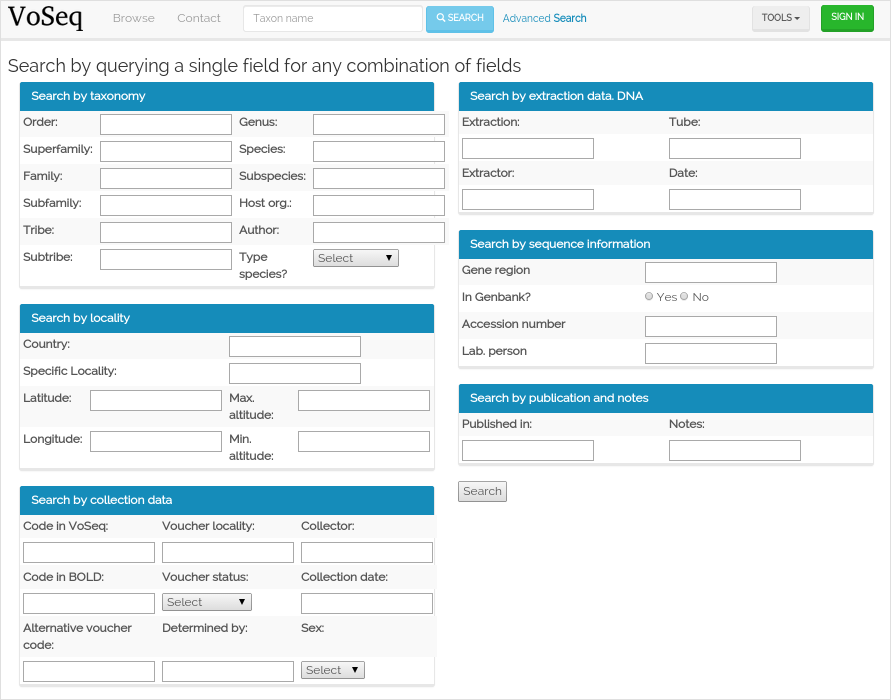

.. _dev:

.. module:: voseq

Advanced search
===============

The advanced search tool allows you find records by queries using single fields
or any combination of them. The autocomplete dropboxes will help you query
existing data easily.

**# TODO:** use the haystack + elastic_search tools to generate the autocomplete
dropboxes for most fields in the **advanced search** graphical user interface.

I have configured Haystack to create two indexes for the data: one for the simple
taxon search and the other for the advanced search:

.. code-block:: python

    HAYSTACK_CONNECTIONS = {
        'default': {
            'ENGINE': 'haystack.backends.elasticsearch_backend.ElasticsearchSearchEngine',
            'URL': 'http://127.0.0.1:9200/',
            'INDEX_NAME': 'haystack',
            'INCLUDE_SPELLING': True,
            'EXCLUDED_INDEXES': ['public_interface.search_indexes.AdvancedSearchIndex'],
        },
        'advanced_search': {
            'ENGINE': 'haystack.backends.elasticsearch_backend.ElasticsearchSearchEngine',
            'URL': 'http://127.0.0.1:9200/',
            'INDEX_NAME': 'advanced_search',
            'INCLUDE_SPELLING': False,
            'EXCLUDED_INDEXES': ['public_interface.search_indexes.VouchersIndex'],
        },
    }

For testing purposes, I specified *EdgeNgramField* only for the field *genus* so it
can be used for autocomplete in the advanced search form. The class defining
this search index is:

.. autoclass:: public_interface.search_indexes.AdvancedSearchIndex

The view is created using a function:

.. autofunction:: public_interface.views.search_advanced

