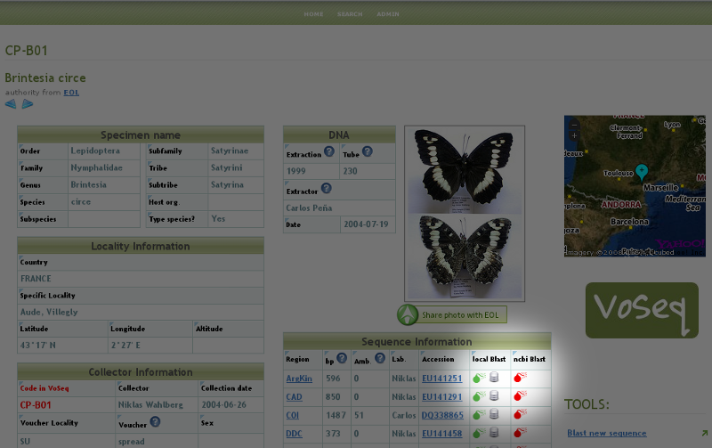
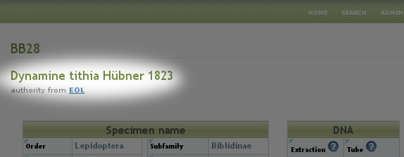
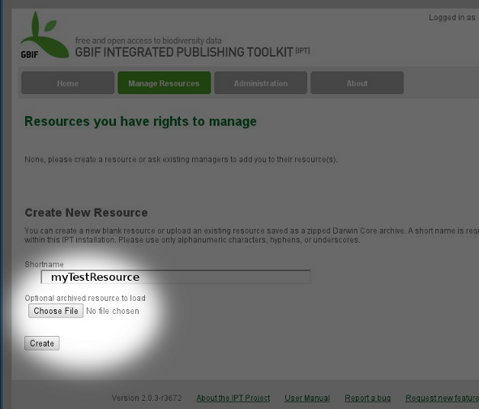
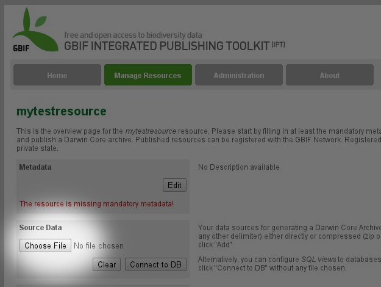

.. VoSeq documentation master file, created by
   sphinx-quickstart on Mon Apr  1 22:15:34 2013.
   You can adapt this file completely to your liking, but it should at least
   contain the root `toctree` directive.

#########################################
Welcome to VoSeq |version| documentation!
#########################################

============
Getting help
============

* Try the :doc:`FAQ <faq>` -- with answers to common questions.
* If you need help regarding installation or usage of th application, please
  contact `Carlos Peña <mycalesis@gmail.com>`_ or `Tobias Malm <tobemalm@gmail.com>`_.
* You can also subscribe to VoSeq's discussion list on
  `Google Groups <https://groups.google.com/d/forum/voseq-discussion-list>`_.

.. toctree::
   :maxdepth: 2
   :hidden:

   news
   faq

Welcome to **VoSeq**, a database to store voucher and DNA sequence data for
phylogenetic analysis. It's a unique database that enables to digitize
biological data of museum specimens and molecular data such as DNA sequences,
primers and genes.

VoSeq has tools that facilitate the batch upload of lots of voucher data and
DNA sequences with a few clicks. It also has
`BLAST <http://en.wikipedia.org/wiki/BLAST/>`_ capabilities, meaning that you
can find out whether one particular
DNA sequence is most similar to other sequence in `NCBI GenBank
<http://www.ncbi.nlm.nih.gov/genbank/>`_. You can also BLAST your sequence
against all others in your VoSeq database (see :ref:`blast-plugin` section for
details).

VoSeq is written in `Python <https://www.python.org/>`_. It uses
`PostgreSQL <http://www.postgresql.org/>`_ as database back-end and it is
designed to run either locally in your own computer or on a remote (commercial)
server service.

==========
Start here
==========

.. toctree::
   :hidden:

   intro/overview
   intro/install

   usage/adding-vouchers

:doc:`intro/overview`
   Find out what VoSeq can do. It might be right for you.

:doc:`intro/install`
   Install VoSeq on your computer or server.

:ref:`configure`
   Create a ``conf.json`` file to specify your settings.

.. _citing-voseq:
=================
How to cite VoSeq
=================
If you think VoSeq is useful and you happen to use it during your work, it
would be great if you cite us as a source:

* Peña, C. & Malm, T. **2012**. VoSeq: a Voucher and DNA Sequence Web Application. *PLOS ONE*, 7(6): e39071.  `doi <http://dx.doi.org/10.1371/journal.pone.0039071>`_

===========
Using VoSeq
===========

:doc:`usage/adding-vouchers`
    Learn how to create records for voucher specimens in VoSeq.

:doc:`usage/adding-genes`
    Learn how to add data about sequenced genes in VoSeq.

:doc:`usage/adding-sequences`
    Learn how to upload DNA sequences to VoSeq.

:doc:`usage/create-taxonset`
    Learn how to group set of vouchers in TaxonSets.

:doc:`usage/create-datasets`
    Learn how to create dataset files for phylogenetic software.

:doc:`usage/search`
    Learn how to do simple and advanced searches.

:doc:`usage/upload-voucher-photos`
    Learn how to upload voucher pictures in VoSeq.

:doc:`usage/create-excel-table`
    Learn how to export data ready for Excel tables.

:doc:`usage/update-voucher`
    Learn how to update voucher and sequence data.

------------
Update VoSeq
------------

The easiest way to update VoSeq (that does not require new install of software or database):

* `Download the new files from github <https://github.com/carlosp420/VoSeq/tags>`_.

    * **Unpack** the new files to your **webserver directory** (htdocs, webserver, etc).
    * **Rename your old "in use" VoSeq folder** something like, 'VoSeq_old' or similar (e.g. "VoSeq-1.4.4" -> "VoSeq_1.4.4_old").
    * **Give the newly downloaded VoSeq folder the same name as the old one had** (e.g. "VoSeq-1.4.4").
    * **Copy the file "conf.php"** (in main folder) from the old version (e.g. "VoSeq_1.4.4_old") to the new version (e.g. "VoSeq_1.4.4").

Also:

* If you have used and installed blast files, make sure to copy the files **Blastdb_aliastool**, **Blast**, **Makeblastdb** and **Makembindex** (.exe for all in windows), from the old version (blast/bin folder) to the new version (same folder). Then **set permissions** to read, write, and execute on the folder "blast/bin" and its content, as well as the folder "include/blast" (e.g. ``chmod 777 -R path_to/~VoSeq_folder/blast/bin``) .

    * For Mac users it may work better to use the ``sudo chown -R _www VoSeq_folder`` command instead, since files belong to user instead of root!

* **If you have voucher photos stored**, transfer them from the old one to the new one also (in ``pictures`` folder).

--------------------------
Backup your MySQL database
--------------------------

You can make backup copies of your data by using a button in the administrator interface.
You will get all your voucher info and sequences into a SQL file. If your server dies you can easily restore your database by importing one of your backups using the **Import database** button.

.. image:: images/import_export_db.png
   :align: center
   :width: 558px

-------
Plugins
-------

^^^^^^^^^^^^^^^^^^
Yahoo! Maps plugin
^^^^^^^^^^^^^^^^^^

**VoSeq** is able to interact with Yahoo! Maps to create on-the-fly maps for vouchers when geographic coordinates are present in voucher pages.
After installing VoSeq, you can enable this capability by getting a **Yahoo! Maps API key** from them and writing them in your ``conf.php`` file:

#. Get an API key from http://developer.yahoo.com/maps/simple/
#. After filling in the required information you will be given a **Consumer Key** consisting of a long string of seemingly random characters that end with two dashes:

    * ``MwRGV2Jm1zbWNHbmnM9Y2Q9WVdrOVVHdj0yzlNQS0tJ9uc3VtZXJzZWNyZXQmeD1iMw--``

#. Remove the two dashes from the end and copy your key into the ``conf.php`` file as a value for the variable ``$yahoo_key``. Like the example below, including quotations and semicolon:

    * ``$yahoo_key = "MwRGV2Jm1zbWNHbmnM9Y2Q9WVdrOVVHdj0yzlNQS0tJ9uc3VtZXJzZWNyZXQmeD1iMw";``

#. Save the file and exit.

After doing this, VoSeq will be able to pull maps from Yahoo! whenever there is geographic information in your database. Note that you need to enter the geographic coordinates into VoSeq converted into decimal format, using the sign minus for the Southern and Western hemispheres.

.. _flickr_plugin:

^^^^^^^^^^^^^
Flickr plugin
^^^^^^^^^^^^^

**VoSeq** hosts all the specimen photos in `Flickr <http://www.flickr.com/>`_. If you have a free account you can host up to 200 photos. The Pro account allows you hosting unlimited number of photos for a yearly fee (25 USD).

#. You need to get an API key from Flickr.
#. Create and account in `Flickr <http://www.flickr.com/>`_ (if you don't own one already)
#. Go to http://nymphalidae.utu.fi/cpena/VoSeq/
#. Follow the instructions to get an **API key**, **Secret key** and **Token key**.
#. After submitting you will get your **Key**, **Secret** and **Token**. Write down those keys.
#. From a text editor software, edit the file ``conf.php`` by copying your keys in it.
#. For example [these are not real keys and will not work if you use them]:

    * ``$flickr_api_key = "2d7f59f9aaa2d5c0a2782d7f5d9083a6";``
    * ``$flickr_api_secret = "ef0def0f3d5f3f15f1";``
    * ``$flickr_api_token = "61607157718372495-f5524ead33b43129";``

#. Save and exit.

Thus, every picture that you upload into your VoSeq installation will be uploaded into your Flickr account.

.. note:: You can share your voucher photos with the Encyclopedia or Life. :ref:`sharing_photos_with_eol`

.. _blast-plugin:

^^^^^^^^^^^^
BLAST plugin
^^^^^^^^^^^^

VoSeq has `BLAST capabilities <http://en.wikipedia.org/wiki/BLAST>`_.

You can search for homologous sequences of your markers in GenBank. If you have a VoSeq installation in your work computer (or your server provider allows you to run the BLAST executable files), you do local BLASTs. For example, BLAST any or your sequences against all sequences of the same gene, or against all your sequences (full BLAST). Click on the "BLAST" icons in your voucher's pages:

You can also copy and paste any new sequence into VoSeq's **Blast new sequence** tool and see whether there are any similar sequence in your data (this tool is located on the sidebar on the right).

Remember that you need to download from NCBI the stand alone BLAST executable files and copy/install them in one of VoSeq's folders:

* In Mac OS X: when you install from the .DMG package, the executable files will be written in the folder: ``/usr/local/ncbi/blast/bin``. You just need to copy them to the right folder in VoSeq:

    * ``mkdir ~/Sites/VoSeq/blast/bin``
    * ``cp /usr/local/ncbi/blast/bin/*   ~/Sites/VoSeq/blast/bin/.``

* In Linux: ``/path/to/your/VoSeq/blast/bin/``
* In Windows: ``C:\Program Files\Apache Software Foundation\Apache2.2\htdocs\VoSeq\blast\bin\``
* It is important that the executable files are placed inside the folder **bin**.

^^^^^^^^^^^^^^^^^^^^
Integration with EOL
^^^^^^^^^^^^^^^^^^^^

#. VoSeq makes it easy to share your voucher photos with EOL. More information here :ref:`sharing_photos_with_eol`.
#. VoSeq makes automated calls to EOL's web services for pulling information on authors and date of description for species. VoSeq sends genus and species names and waits for a response. If EOL response is positive, the full species name will be included in voucher pages:

.. _sharing_photos_with_eol:

^^^^^^^^^^^^^^^^^^^^^^^
Sharing Photos with EOL
^^^^^^^^^^^^^^^^^^^^^^^

VoSeq makes it easy to share your voucher photos with EOL. You can submit your best photos to EOL from VoSeq with just one click.

If you haven't done it already, you need to create an account in Flickr. Then log in to Flickr with your account and join the EOL group:

#. Go to http://www.flickr.com/groups/encyclopedia_of_life
#. Click **"Join This Group"**

Be aware that EOL requires that your photo is under any of the following licenses:

* Creative Commons Attribution (`CC-BY <http://www.flickr.com/creativecommons/>`_)
* Creative Commons Non-Commercial (`CC-BY-NC <http://www.flickr.com/creativecommons/>`_)
* Creative Commons Share-Alike (`CC-BY-SA <http://www.flickr.com/creativecommons/>`_)
* Creative Commons Non-Commercial Share Alike (`CC-BY-NC-SA <http://www.flickr.com/creativecommons/>`_)

In your VoSeq installation, you will see a button:

.. image:: images/share_with_eol.png
   :align: left
   :width: 158px

under your voucher photos. If you click this button, VoSeq will add a "machine tag" to the corresponding page in Flickr so that in can be harvested by EOL.

Thus you will be able to see your photo in EOL's pool of photos in their Flickr account http://www.flickr.com/groups/encyclopedia_of_life/pool/with/4096153224/

EOL harvests the photos quite frequently, so in one day or two, you will be able to find your photo in the respective page in EOL.

^^^^^^^^^^^^^^^^^^^^^
Integration with GBIF
^^^^^^^^^^^^^^^^^^^^^

""""""""""""""""""""""""""""""""""""""""""""""""""""""""
You can share your information hosted in VoSeq with GBIF
""""""""""""""""""""""""""""""""""""""""""""""""""""""""

GBIF prefers data owners to use their `Integrated Publishing Toolkit (IPT) <http://www.gbif.org/informatics/infrastructure/publishing/#c889>`_. This means that you can install their IPT software to produce a resource in Darwin Core format that can be harvested by GBIF. In addition to the actual data in your VoSeq installation, IPT allows you to include a rich variety of metadata for GBIF.

VoSeq is able to produce a dump file containing all the data you own. Then you can import this file into a IPT installation and choose which types of data you want to publish via GBIF. Once you include all the metadata required by GBIF you have two choices in order to expose your data taken from `GBIF website <http://www.gbif.org/informatics/standards-and-tools/publishing-data/>`_:

* By setting up a dynamic server software:

    #. Acquire hardware with a permanent Internet connection (a regular PC is sufficient).
    #. Install data publishing software. GBIF recommends the Integrated Publishing Toolkit (IPT). You will need a web server such as Apache.
    #. Configure the software for your local data structure; this is the 'mapping' process. Please follow the documentation of your chosen publishing software for this process.
    #. Register your service with GBIF and sign the GBIF Data Sharing Agreement.
    #. Create an archive for your entire dataset:

        * This scenario doesn't require a permanent Internet connection. You simply need to create a Darwin Core Archive, upload it to a repository (for example an IPT repository installed by your GBIF Participant Node, an institutional FTP or web server, or a service like Dropbox or the Internet Archive). You then just need to register the public URL for the storage location of your archive with GBIF.

"""""""""""""""""""""""""""""""""""""""""""""""""
Create a dump file and use in an IPT installation
"""""""""""""""""""""""""""""""""""""""""""""""""

#. You can create a dump file with all the data in your VoSeq installation for submitting to GBIF. In VoSeq, on the sidebar on the right, click on **Share data with GBIF**. Save this file and open an installation of IPT.
#. In IPT, click on **Manage Resources** in the top menu, enter a name for your resource and click **Create**. Note: do not upload your file in this page (it will fail to recognize your tab delimited dump file).

#. You will be directed to your test resource page. This is when you upload the dump file generated in VoSeq. And then you are ready to add a rich variety of metadata to your resource and become a provider of information to GBIF.

