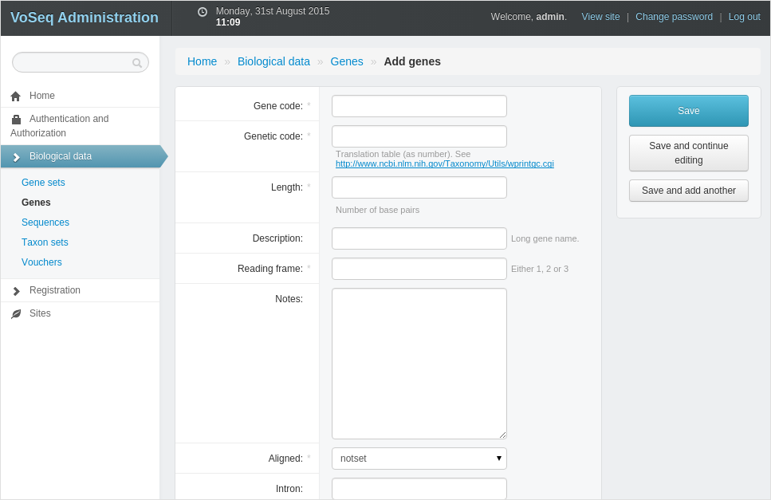

.. _adding_genes:

^^^^^^^^^^^^
Adding genes
^^^^^^^^^^^^

The second thing after adding vouchers that should be done is to create **new genes**
or "alignments" for your database. This must be done in order to be able to
**add sequences** to the database.
You can add a single record by going to the **Administrator interface** and
clicking on the link **Biological data » Genes**, followed by
**Add genes**.

The most important and the only field that is obligatory is the **gene code**
field, this will be the name of your gene when using the database. This could
be a simple short version (e.g. **COI** for **Cytochrome oxidase I**) or any
other name (no spaces allowed, but underscores **_** are ok).
For example, you can create a gene code for aligned data, say the barcode
version of COI of 658 bp could be named COI_658 or similar. Other gene codes
could be made for unaligned sequences (e.g. COI_raw).

The gene/alignment have to be **specified if aligned or not**. For example,
raw sequences be set to **no** (and these may be retrieved as FASTA-files,
whereas if you want to build other datasets (Nexus, PHYLIP, TNT) they need to
be set to aligned. If set to **no**, then other information regarding reading
frames and such will be ignored!

Then (if aligned) you should include the **length** of an aligned gene
—this will be used for dataset creation and will there warn for sequences
longer than the specified length.

You may also add a **description** for the gene
—these should be the **full name of the gene**
(e.g. **Cytochrome oxidase I**)— as this field is used for example in creating
tables to submit to **GenBank**.

Aligned genes may be set as **protein-coding** for **additional prot-coding
gene functionality** when retrieveing datasets for example (e.g. position
choices, translation).

For aligned protein coding (=yes) genes you may choose to specify the
**reading frame** as well as the genetic code for translation —this will be
used for dataset creation and is a must f you want to partition your genes
according to **codon positions** or **amino acids**.

.. **Introns** may be added —enter number of introns in your alignment
   and click 'update introns', that will give new fields for entering starting and
   finsihing positions for your introns. (Remember that positions in an alignment
   here is counted from 1 and upwards).
