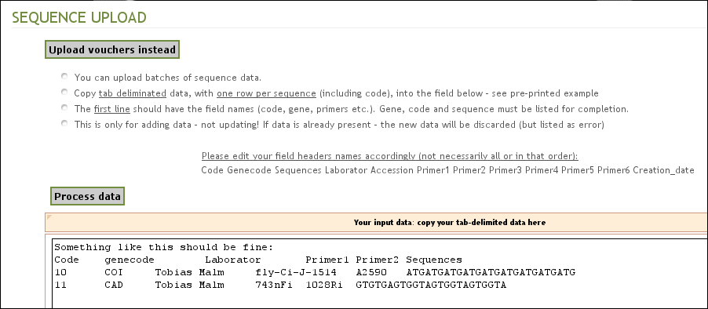

.. _adding_sequences:

^^^^^^^^^^^^^^^^
Adding sequences
^^^^^^^^^^^^^^^^

In the **Administrator interface**, you can import batches of DNA sequences from
MS Excel files under the path **Biological data » Sequences***
the tool **Upload batch sequences/vouchers**.

Along with the DNA sequences, you have to upload the required fields
**gene code** and **code**, optionally labperson, notes and "genbank".
The data value in **genbank** field should be either 0 or 1. Cero denotes that
the sequence has not been uploaded to NCBI Genbank and 1 denotes that it has.
Each sequence and its related data goes into one line, with one data field for each column.

* It is important to use the same headers provided in the text area.
* It is also necessary that that the **code** of each sequence matches the **code**
  of voucher specimens that had been uploaded into VoSeq.
  This is the unique identifier that is used to connect the voucher data and
  their sequences.

(Aligned sequences should for best use of the database have missing data coded as questionmark (?) and gaps as a dash (-))

