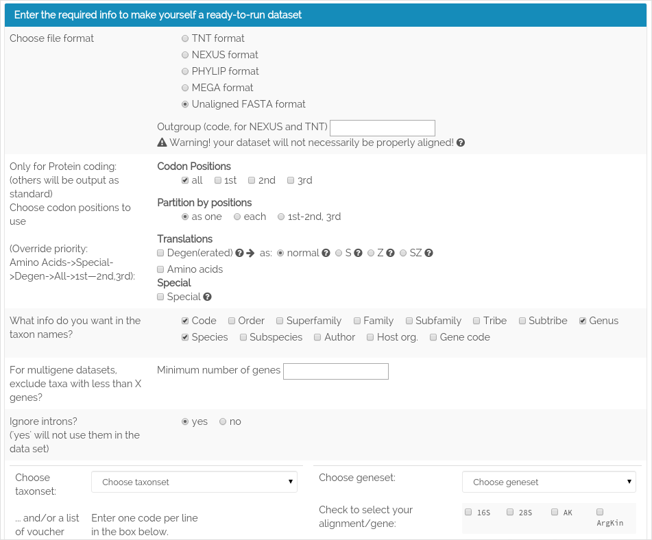
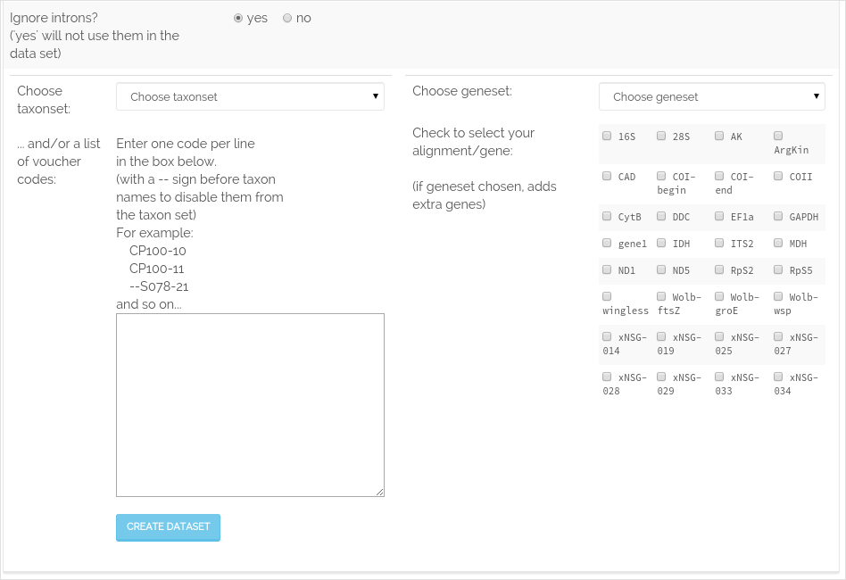

.. _create_datasets:

^^^^^^^^^^^^^^^
Create datasets
^^^^^^^^^^^^^^^

We believe that one of VoSeq's important features is the **capability to create
dataset files of molecular sequences that are ready-to-run in phylogenetic
software** such as **MrBayes, TNT, PAUP, NEXUS**, etc.

Now that you have voucher and sequence data in your installation of VoSeq,
you might want to create datasets for analysis of sequences in phylogenetic software.

In the **user interface**, you will find under the **Tools** section the link
**Create new dataset**. You will be shown a page to select the sequences you
want by entering the **voucher codes** and **gene codes**. You can select your
data to be in several formats (FASTA, NEXUS, etc), choose between codon positions,
as well as choosing what information your taxon names should include.

This will create a **ready-to-use** data set for analyses!

The **Outgroup** field, if needed, should include the voucher code for the chosen outgroup taxa.

Codon positions
    Marking **1st**, **2nd** or **3rd** and unmarking **all** positions will
    create a dataset with only the chosen position(s) for all genes.
    **Special** will take you to a new page where you will be able to choose
    which codon positions to include for each gene.
    Marking **amino acids** will tranlate **protein-coding** genes with a set
    **genetic code** , the others will be treated as normal dna, i.e. making
    "mixed" datatype in Nexus for MrBayes, and setting partitions correctly in Nexus and PHYLIP format.
    Note that codon position choices as well as translation to aminoacids are
    only able to function if the user have specified a **reading frame** for
    the chosen gene(s) (see :ref:`adding_genes`).

Partition by (position)
   Here you can choose how to do partitioning for each gene.
   **as one** will create one partition per gene, regardless of which codon
   positions you include.
   **each** will create a partition per codon position, whereas **1st-2nd,
   3rd** will create one combined partition for the 1st and 2nd positions and
   one separate for the 3rd codon positions.
   Note that **each** and **all** are only possible to process with a per gene
   specified **reading frame** (see :ref:`adding_genes`).

You can also chose to **omit taxa from a taxonset that contains less than a
specific number sequences**. Say you have a 10 gene data set and want to remove
all taxa with 5 or less! Easy! Just eneter a minimum number of genes!

If you have introns in your alignment you can choose to include or remove them
from the output data set. If included they will be treated as separate data
blocks and partitions for the Nexus and PHYLIP outputs!

The voucher codes can be entered one by one (separated by return) in the text
area or you could create a :ref:`create_taxonset` (a list of voucher codes for
a specific project).

.. note:: As of version 1.5.0, protein-coding ability, aligned or not, introns
          and genetic code will be set for each gene/alignment in the admin gene section!
