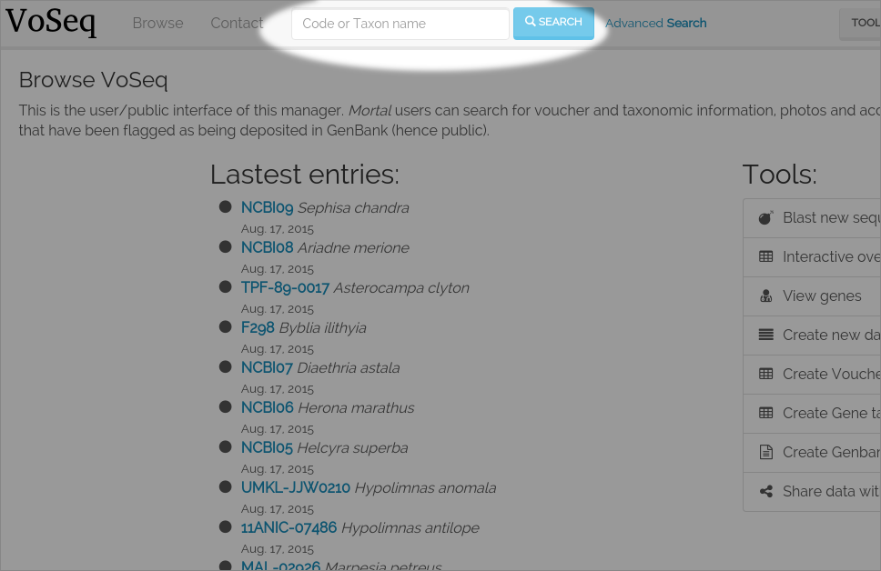
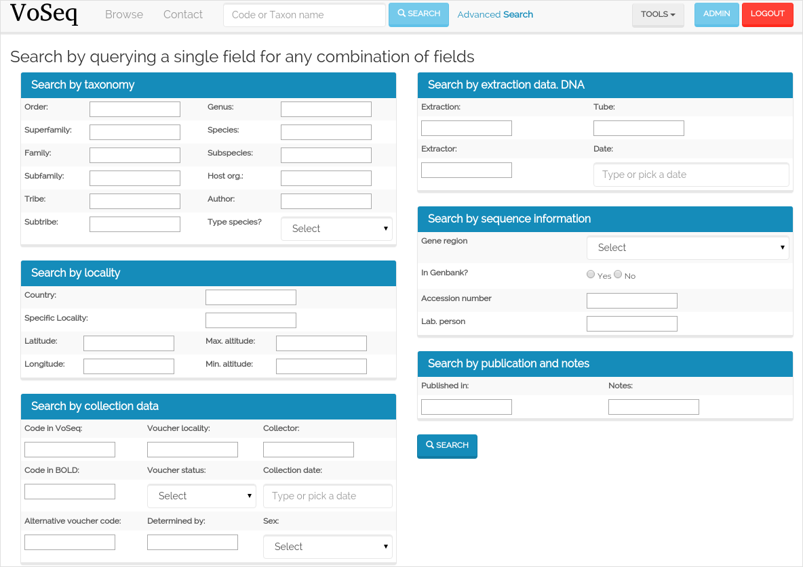

.. _my_search:

^^^^^^
Search
^^^^^^

You can search for records by queries using single fields or any combination of
them. The autocomplete dropboxes will help you query existing data easily.
This can be done in both the **user interface** and the **administrator
interface**.

Simple taxon search:

Advanced search:

