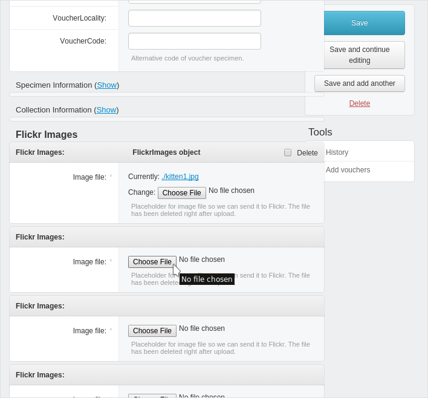

.. _upload_voucher_photos:

^^^^^^^^^^^^^^^^^^^^^
Upload voucher photos
^^^^^^^^^^^^^^^^^^^^^

In the **Administrator interface** you will be able to upload one or more photos
for your voucher records:

If you want to replace an existing picture with another, you will need to
click the **Choose File** button.

If your have configured VoSeq to use Flickr as repository for your photos
(see section :ref:`configure`), after you upload your photo, VoSeq will automatically **post the picture in Flickr**
and save the necessary URL addresses in the postgreSQL database.
Thus, you will see your photo in the corresponding voucher page.

**If you don't want to use Flickr**, you can host your photos locally on your
own server or computer. For this you will need to edit a line in your ``conf.json`` file:

* Change the line:

    * ``"PHOTOS_REPOSITORY": "flickr"``

* to this one:

    * ``"PHOTOS_REPOSITORY": "local"``

Starting with version 1.5.0, VoSeq can host many photos for each voucher. Photos
can be added in the voucher page using the administrator interface of VoSeq.
You can delete photos individually by clicking on "Delete" checkbox.
