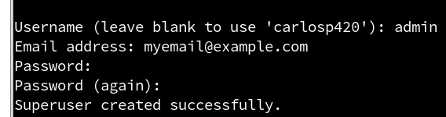
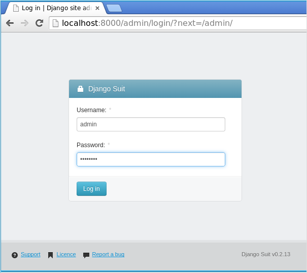
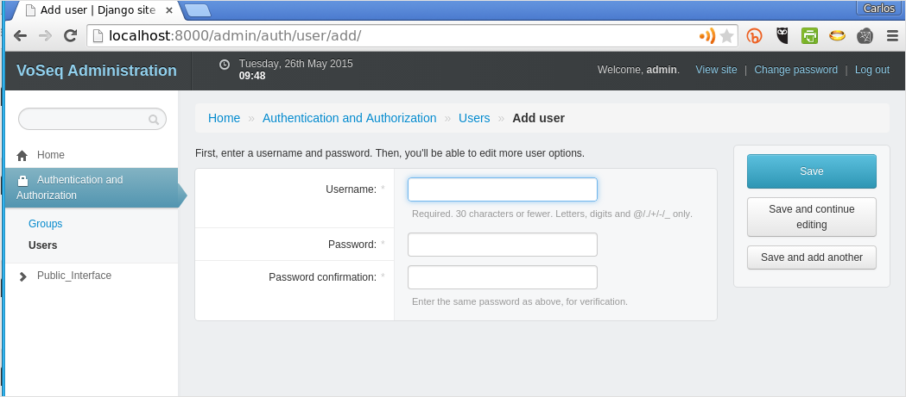

=====
Usage
=====

Create a superuser for VoSeq
----------------------------
In every Django-based web application, such as VoSeq, it is necessary to create
a superuser account that will be able to create other user accounts, set up 
permissions, reset passwords, etc.

To create a superuser you need to run the following  command from a terminal or
console:

.. code-block:: shell

    make admin

You will need to answer a few questions and enter your password.

After this, you should be able to log in as administrator and start creating
accounts for other users in your research group. Point your web browser to this
address http://localhost:8000/admin/ (assuming that you have used the command
``make serve`` and VoSeq is running in your computer).

You can create users and change passwords for old users. Also, you can set the
different levels of permissions for your users.

User's permissions
------------------
Only logged users are able to see the actual DNA sequences for vouchers. Users
that do not have accounts in VoSeq will be redirected to the login page.

As users cannot create accounts for themselves, only those users with accounts
created by the superuser (administrator) will be able to access those
sequences.

The same for creation of datasets. Only authorized users (those that hold an
account) will be able to retrieve DNA sequences from VoSeq.
